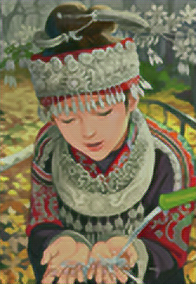
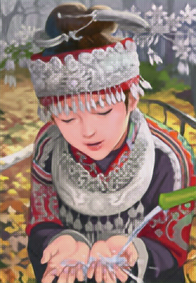

|模型名称|
模型构成
|psnr|效果图|
效果描述
|
猜测原因|
|:---:|:---|:---|---|:---|:---|
|SPCNet_with_PL|亚像素卷积 感知损失|14.734442234039307||有明显的棋盘效应|使用了感知损失，卷积过后的图片都是带有棋盘效应，他们之间计算损失很难将棋盘效应去掉|
|SPCNet_without_PL|亚像素卷积 |23.348572254180908||最原始的亚像素卷积||
|Residual_SPC_with_PL|亚像素卷积 resblock 感知损失|19.9370276927948||棋盘效应很明显，但有一定的锐化细节的效果||
|Residual_SPC_without_PL|亚像素卷积 resblock中|23.724725246429443||将亚像素卷积前半部分换成残差块，有一定的效果||
|RC_with_PL|缩放卷积 resblock中使用空洞卷积 感知损失使用relu2_2|20.142207145690918||棋盘效应有所减弱|缩放卷积使用了双线性插值来放大图片，会将细节部分平滑|
|RC_with_PL|缩放卷积 resblock中使用空洞卷积 感知损失使用relu4_3|20.79200267791748||对比relu2_2，大面积色块的棋盘效应有所减弱||
|RC_without_PL|缩放卷积 resblock中使用空洞卷积\[1,2,5\] 感知损失|21.396241188049316||不使用感知损失，细节部分会比较朦胧||